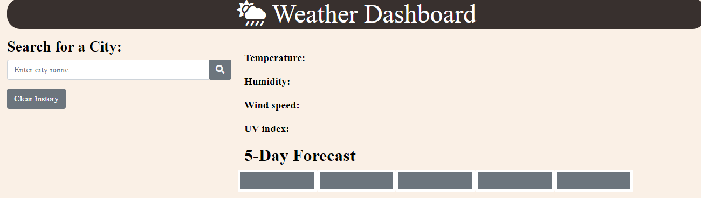
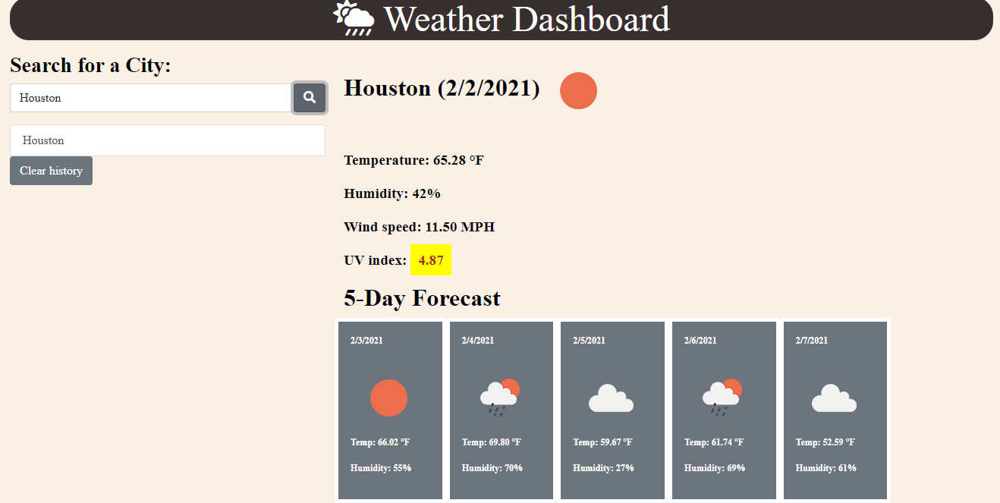
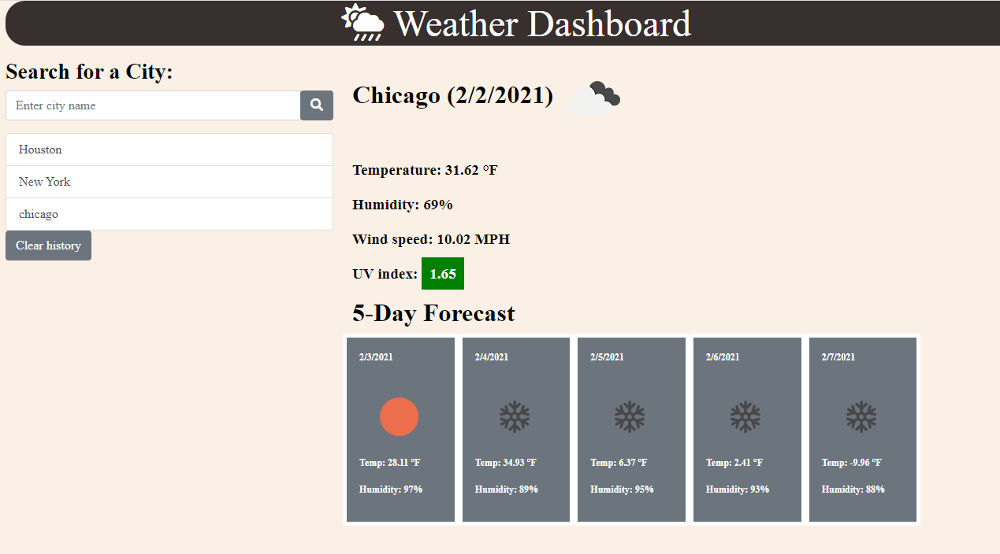
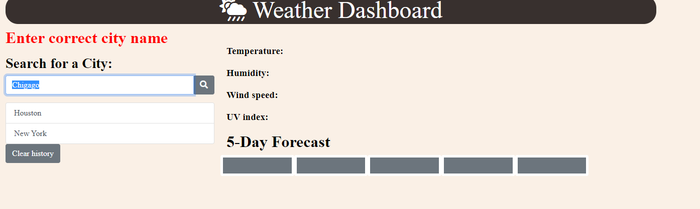

# Weather_Dashboard

## Summary

HTML, Bootstrap, CSS and Javascript documents create a weather application. This app is using the third party API from [OpenWeather API](https://openweathermap.org/api) to retrieve weather outlook for multiple cities.

### Project features:

- A search bar for city list from local storage
- Current weather condition
  - city name
  - date
  - an icon representation of weather conditions
  - temperature
  - humidity
  - wind speed
  - UV index
- Future weather condition for 5 days
  - date
  - an icon representation of weather conditions
  - temperature
  - humidity
- Reponsive layout

### Script features:

- 3 API calls
- Event listener (onclick)
- Local Storage
- functions, for loop and if condition

## Project Demo

#### Search for a city weather condition

Current and future weather conditions for that city

UV index is presenter with a color that indicates whether the conditions are

favorable(green), moderate (yellow), or severe (red).

Future weather conditions for that city is presented with a 5-day forecast.

City is added to the search history.

User will be able to click on the search history list to view weather conditions.

Clear history button will clear the local storage.

When weather dash board app is rendered it will present last search city forecast.

When city name is not found in API it will present error text.

## Link

https://kannavairavan.github.io/Weather_Dashboard/

## Repository

https://github.com/KannaVairavan/Weather_Dashboard.git

## Technologies

Visual Studio code, HTML5, bootstrap, CSS, Javascript
